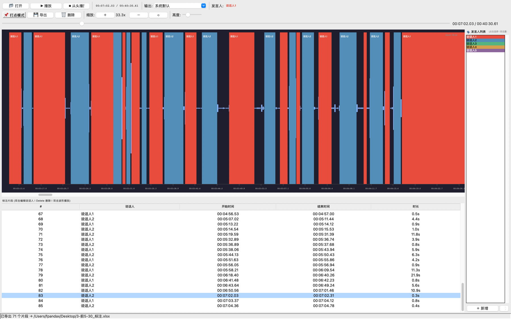

# Audio Annotator — 会议音频说话人标注工具

手动标注音频文件中每个说话人的起止时间，导出结构化文本。

## 功能

- 📂 导入 WAV 音频文件，显示波形
- 🖱️ **鼠标拖拽波形** → 定义片段起止时间
- 🗣️ **右侧发言人列表面板** — 点击切换当前发言人，双击重命名为真实姓名
- 🔍 **缩放控制** — 按钮/Ctrl+滚轮缩放时间轴，精细标注
- 📏 **高度调节** — 滑块调节波形高度，适应不同屏幕
- ▶️ 播放/暂停/从头播放，指示线实时跟随
- ✏️ 双击片段编辑说话人名称
- ↔️ 拖拽片段边缘调整起止时间
- ✂️ 选中片段后可拆分，或与下一段合并
- 🗑️ Delete 键删除片段
- 💼 保存/打开 `.aaproj` 项目文件，支持中途继续标注
- 💾 导出为文本(Tab分隔)、CSV 或 Excel(.xlsx)
- ⏱️ 支持长音频（小时级），时间轴和导出均显示 HH:MM:SS.cc

## 已知修复

- 播放结束自动重置播放按钮和指示线位置
- 音频输出跟随系统设置（外放/耳机自动切换）
- 播放指示线高频刷新（500fps），无明显延迟
- 导出时间格式统一为 HH:MM:SS.cc，小时位正确显示
- 修复发言人重命名后已有片段未同步更新的问题
- CLI 导出兼容带表头的标注文件

## 版本迭代变更

### 当前版本

- **数据模型重构**：新增 `models.py`，引入 `Segment`、`Speaker`、`AnnotationProject`，把片段编辑和项目序列化从界面逻辑中抽离出来。
- **项目保存/恢复**：新增 `.aaproj` 项目文件，保存音频路径、发言人列表、颜色和所有标注片段，支持中途关闭后继续标注。
- **片段编辑增强**：支持拖拽片段左右边缘调整起止时间；选中片段后可按当前播放头拆分，或与下一段合并。
- **发言人状态同步**：重命名/删除发言人后，会同步更新已有片段和波形显示，减少 UI 状态不一致。
- **自动化测试体系**：新增 `tests/`，覆盖数据模型、项目保存加载、片段拆分/合并/调整、时间格式、CLI 导出和模块导入。
- **依赖声明补齐**：`pyproject.toml` 已声明 `numpy`、`sounddevice`、`soundfile`、`openpyxl`。

### 后续规划

- 增加更细粒度的片段时间微调按钮（例如 +/- 0.1s）。
- 增加片段重叠提示和批量修复。
- 将音频播放、导出逻辑继续拆分为独立模块。
- 在手动标注体验稳定后，再接入自动说话人识别作为初稿导入功能。

## 环境要求

| 组件 | 版本 | 说明 |
|---|---|---|
| Python | 3.8+ (当前 3.13.9) | 使用 miniconda3 管理 |
| macOS | 12+ (当前 26.5.1) | Apple Silicon (arm64) |
| numpy | 2.4.6 | 波形峰值计算 |
| sounddevice | 0.5.5 | 音频播放（内置 PortAudio） |
| soundfile | 0.14.0 | 音频文件读写 |
| tkinter | 8.6 | GUI 框架（Python 自带） |
| ffmpeg | 8.1.2 | 需包含 ffprobe（用于获取音频时长） |

## 依赖安装

```bash
# 推荐：创建 conda 环境
conda create -n audio-annotator python=3.13 -y
conda activate audio-annotator

# Python 依赖
pip install numpy sounddevice soundfile openpyxl

# ffmpeg（含 ffprobe）
brew install ffmpeg
```

## 使用

```bash
# 直接运行
python main.py

# 打开文件时直接传入
python main.py /path/to/meeting.wav
```

## 自动化测试

```bash
env PYTHONDONTWRITEBYTECODE=1 python -m unittest discover -s tests -v
```

测试设计见 `docs/testing_strategy.md`。

## 默认设置

- 默认包含 **说话人1**、**说话人2** 两个发言人
- 每个发言人自动分配不同颜色，波形和列表中以色块区分
- 可通过面板 **＋ 新增** 添加更多发言人
- 双击发言人名称可 **重命名** 为真实姓名（如"张三"、"李四"）

## 导出格式

### TXT (Tab分隔)
```
讲话人	开始时间	结束时间	时长
说话人1	00:14:18.00	00:15:44.00	00:01:26.00
说话人2	00:15:44.00	00:15:48.00	00:00:04.00
```

### CSV (Excel)
```
讲话人,开始时间,结束时间,时长
说话人1,00:14:18.00,00:15:44.00,00:01:26.00
说话人2,00:15:44.00,00:15:48.00,00:00:04.00
```

### XLSX (Excel)
```
| 讲话人 | 开始时间      | 结束时间      | 时长        |
|--------|--------------|--------------|-------------|
| 说话人1| 00:14:18.00  | 00:15:44.00  | 00:01:26.00 |
| 说话人2| 00:15:44.00  | 00:15:48.00  | 00:00:04.00 |
```

## 操作说明

| 操作 | 说明 |
|---|---|
| 📂 打开 WAV | 选择音频文件（macOS 原生文件选择器） |
| 右侧面板点击发言人 | 切换当前标注用的发言人 |
| 双击右侧发言人名称 | 重命名（如改为真实姓名） |
| ＋ 新增 | 添加新的发言人 |
| 鼠标拖拽波形 | 在波形上拖拽定义片段起止 |
| 双击波形 | 跳转到该位置播放 |
| Ctrl + 滚轮 | 缩放时间轴（放大/缩小） |
| 滚轮 | 水平滚动 |
| ＋ / － / ⟲ 按钮 | 放大 / 缩小 / 重置缩放 |
| 高度滑块 | 调节波形显示高度 |
| 双击片段 | 编辑说话人名称 |
| Delete | 删除选中片段 |
| 💾 导出标注 | 保存为 TXT、CSV 或 XLSX 文件 |

## 缩放说明

- **放大**：查看短时间范围内的精细波形，适合标注快速对话
- **缩小**：查看全局，适合概览整个会议结构
- **Ctrl + 滚轮**：以鼠标位置为中心缩放
- 缩放范围：1x（全览）到 50x（极精细）
- 点击 **⟲** 重置为全览

## 音频输出

- 默认跟随**系统音频输出**（外放/耳机自动切换）
- 可通过顶部"输出"下拉框手动选择设备

## 项目结构

```
audio_annotator/
├── main.py              # 主程序入口
├── models.py            # 数据模型、片段编辑逻辑、项目保存/加载
├── waveform_widget.py   # 波形画布组件（缩放/高度/播放头）
├── segments_table.py    # 片段列表组件
├── speaker_panel.py     # 发言人列表面板
├── tests/               # 单元测试
├── test_export.py       # 手动导出测试脚本
└── README.md            # 使用说明
```

## License

MIT
